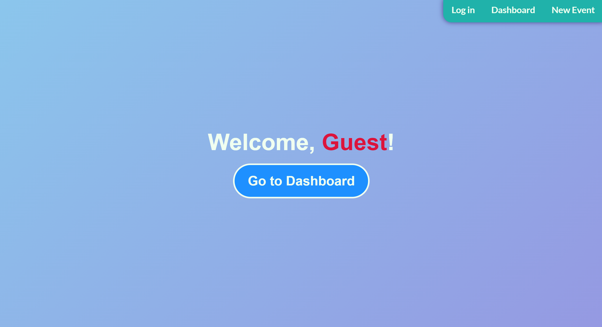
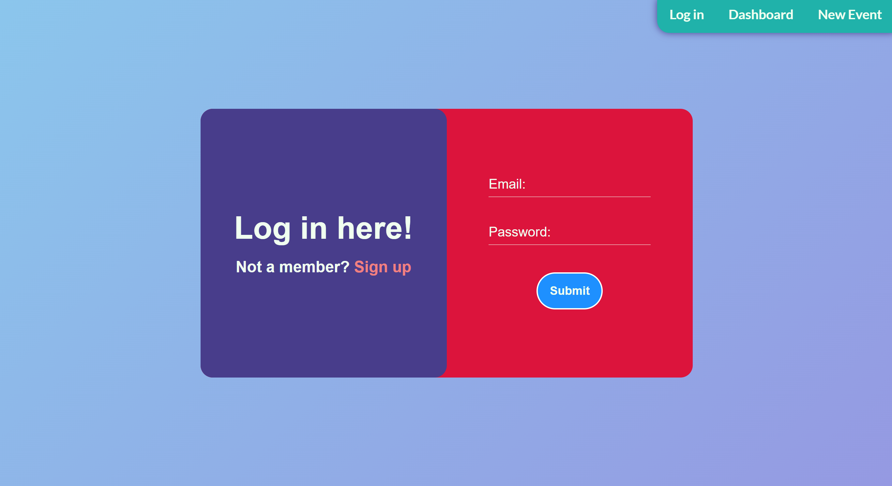
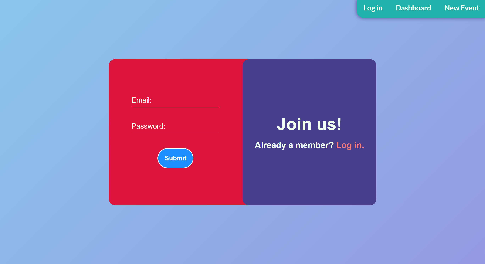
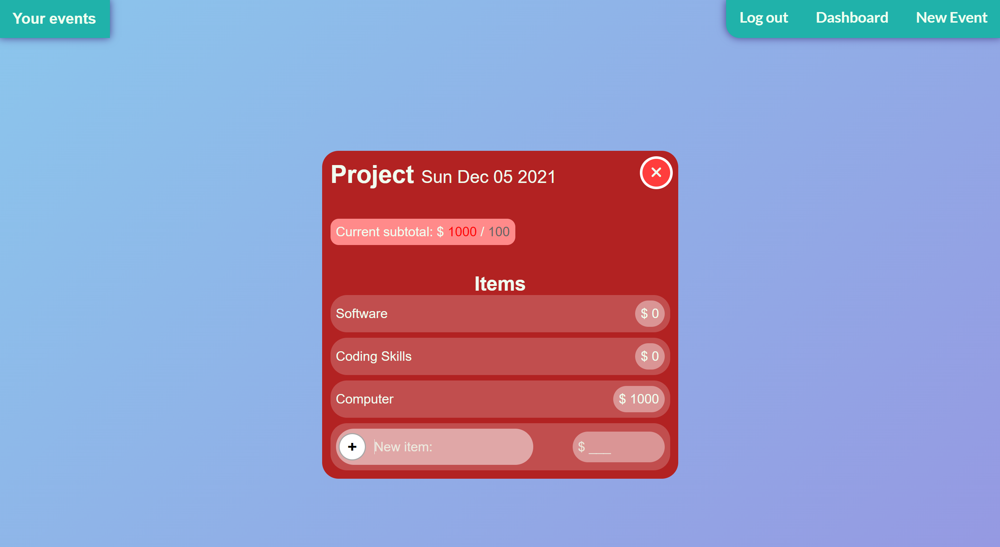
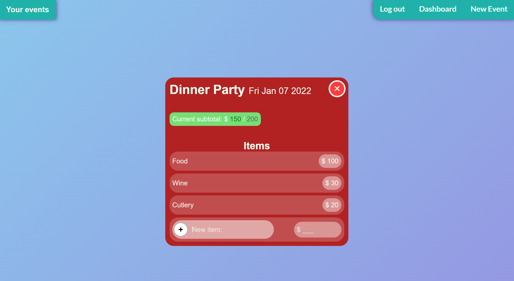

# Budget Better

<p align="center">
	<a href="https://rutgers-budget-better.herokuapp.com/">
		
	</a>
</p>

## Table of Contents

- [Budget Better](#budget-better)
	- [Table of Contents](#table-of-contents)
	- [Description](#description)
	- [MVP](#mvp)
	- [Full Project](#full-project)
	- [Tech Stack](#tech-stack)
	- [How to run](#how-to-run)
	- [Screenshots](#screenshots)

## Description

Budget Better is an application that aims to reduce the stress and anxiety that comes along with planning for an event. Whether your event is a grand wedding, a casual dinner party, or even just grocery shopping, Budget Better will help keep your finances in check. Through the application, you can create an event with a set budget and begin to add items each with their own cost. Budget Better will track your running total of all the items you input and even visually notify you if you go over budget! Not to worry though, if you decide you don't need a certain item you can delete it. If you're not sure whether you need the item, but don't want to include it in your running total, Budget Better also allows you to "turn it off" and it won't be included in the final tally.

## MVP

```
When a user visits the website they are greeted with a sign in page. Once the user is signed in, they are taken to a dashboard of each event that is stored in the database for that user. They can view saved events, or create a new event.
When the user creates a new event, they add a title, budget, and date. Then, they can start to add line items of various things that are needed for such event. For example, if a user creates an event for a wedding,
they can create line items for:
flowers, limo, and catering. They will then enter the cost of each item on the front end, and we will take that entered information and send it in a post request to the database.
```

## Full Project

```
When a user visits the website they are greeted with a sign in page. Once the user is signed in, they are taken to a dashboard of each event that is stored in the database for that user. They can view saved events, or create a new event.
When the user creates a new event, they add a title, budget, and date. Then, they can start to add line items of various things that are needed for such event. For example, if a user creates an event for a wedding,
they can create line items for:
flowers, limo, and catering. They will then enter the cost of each item on the front end, and we will take that entered information and send it in a post request to the database.
The user also has the ability to delete any line item or event that they choose. If they don't want to "hard-delete" something, the user can toggle an item on or off so that it doesn't affect their subtotal of all the items in that event.
```

## Tech Stack

- Gulp (build system)
- SCSS (styling)
- Handlebars (templating engine)
- MySQL (database)
- Sequelize ORM

## How to run

`yarn install` (or `npm install`) followed by `yarn start` (or `npm start`)

## Screenshots

Landing Page



Login Page



Signup Page



Over Budget Event



Under Budget Event



Including/Not including certain items GIF with deletion functionality


